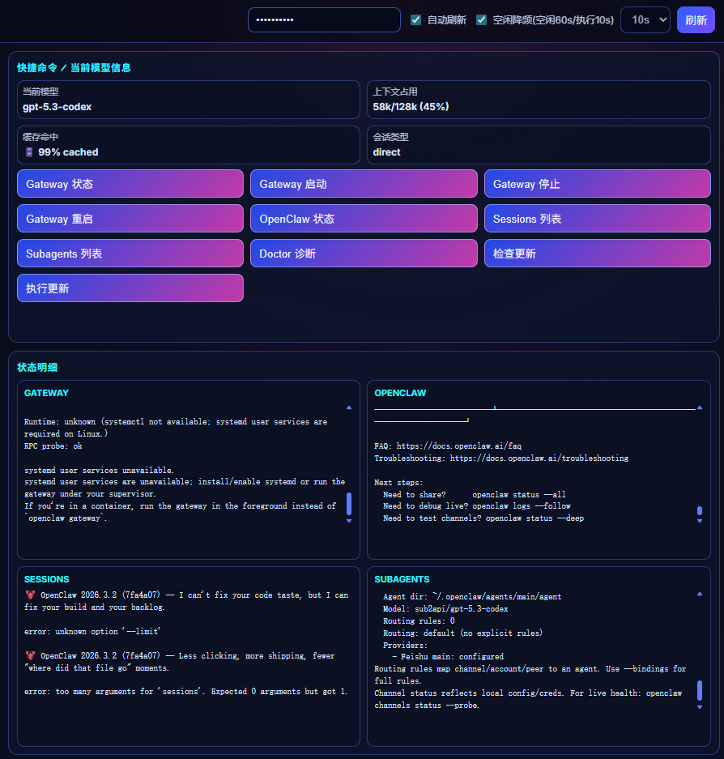
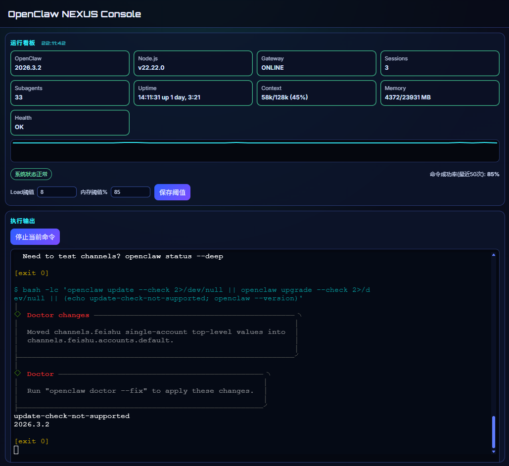
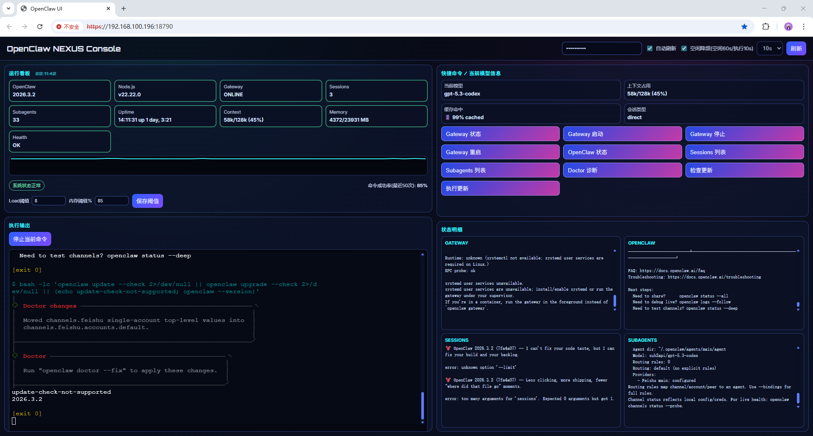
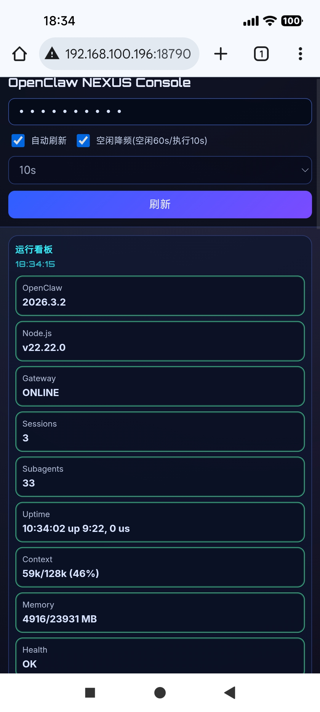
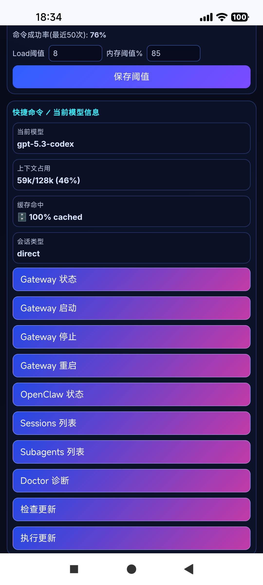
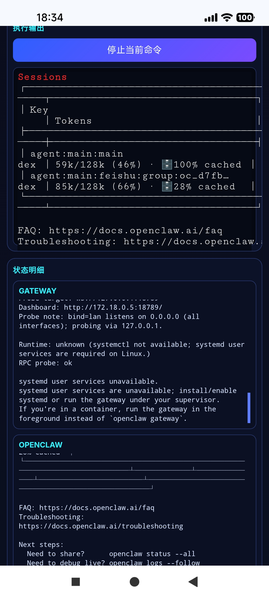
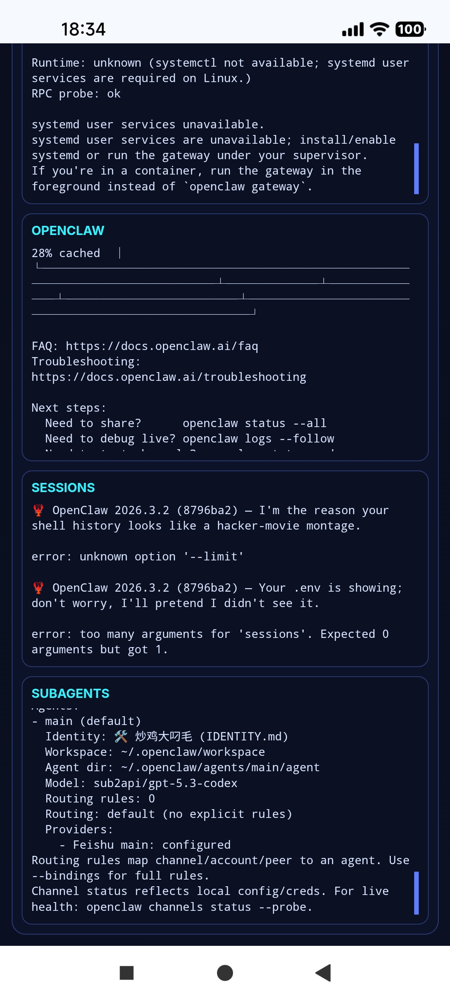

# openclaw-ui-ops


Operations toolkit and web console for OpenClaw, including a standalone dashboard app: `openclaw-ui`.

## Preview

### Desktop (real screenshots)
<p>
  
  
  
</p>

### Mobile (real screenshots)
<p>
  
  
  
  
</p>


> Goal: provide a single visual entrypoint for runtime status, sessions/subagents monitoring, quick ops commands, and audit logs.

---

## What is included

- `openclaw-ui/` — standalone web console (Express + WebSocket + PTY)
- `openclaw-ui/scripts/` — bundled start/watchdog scripts
- `deploy/` — deployment playbooks
- `docs/` — architecture and showcase assets

---

## Key features

- Runtime board: OpenClaw / Gateway / Sessions / Subagents / resource status
- Quick command buttons with real-time terminal streaming
- Audit log output (`openclaw-ui/audit.log`)
- Optional token auth (`UI_TOKEN`)
- Mobile-friendly responsive layout
- Auto-recovery scripts via watchdog

---

## Quick start

```bash
cd openclaw-ui
npm install
PORT=18790 HOST=0.0.0.0 npm start
```

## Token auth setup (recommended)

Option A: environment variables

```bash
cd openclaw-ui
UI_TOKEN='replace-with-a-strong-random-token' PORT=18790 HOST=0.0.0.0 npm start
```

Option B: config file workflow

```bash
cd openclaw-ui
cp .env.example .env
# edit UI_TOKEN in .env
set -a; . ./.env; set +a
npm start
```

Notes:
- Template file: `openclaw-ui/.env.example`
- When `UI_TOKEN` is enabled, enter the same token in the top-right token field.
- Requests without valid token will return `401 unauthorized`.

Open:

- Local: `http://localhost:18790`
- LAN: `http://<your-ip>:18790`

---

## Docker (recommended)

Make sure port mapping is enabled:

```bash
-p 18790:18790
```

A ready-to-use compose file is included: `deploy/docker-compose.yml`

Quick start:

```bash
cd deploy
cp .env.example .env
# edit UI_TOKEN in .env
docker compose up -d
```

---

## Security recommendations

1. Enable `UI_TOKEN`
2. Put behind Nginx/Caddy with HTTPS
3. Keep dashboard private (LAN/VPN/IP allowlist)
4. Rotate logs (`ui.log`, `audit.log`)

---

## Auto-recovery scripts

- `openclaw-ui/scripts/start.sh`
- `openclaw-ui/scripts/watchdog.sh`
- `openclaw-ui/scripts/watchdog-loop.sh`

---

## Packages (GitHub Packages)

A GHCR publish workflow is now included (`.github/workflows/publish-ghcr.yml`).
After publishing, the image will appear in the repository **Packages** panel.

Image name:
- `ghcr.io/zhanfangege/openclaw-ui-ops:v0.1.0`
- `ghcr.io/zhanfangege/openclaw-ui-ops:latest`

Pull example:

```bash
docker pull ghcr.io/zhanfangege/openclaw-ui-ops:latest
```

---

## Downloadable release assets

A ready-to-download release package is included in `releases/`:

- `releases/openclaw-ui-ops-v0.1.0.tar.gz`
- `releases/openclaw-ui-ops-v0.1.0.sha256`

Checksum verification:

```bash
sha256sum -c releases/openclaw-ui-ops-v0.1.0.sha256
```

---

## Documentation

- Chinese README: `README.md`
- Changelog: `CHANGELOG.md`
- Roadmap: `ROADMAP.md`
- Release notes: `RELEASE_NOTES_v0.1.0.md`
- Cold-start deploy checklist: `DEPLOY_CHECKLIST.md`
- UI details: `openclaw-ui/README.md`
- Architecture: `docs/ARCHITECTURE.md`
- Deployment guides: `deploy/`
- Docker verification checklist: `deploy/VERIFY.md`

---

## License

This project is **fully open-source** under the MIT License.
You are free to use, modify, and distribute it for personal and commercial use.
See `LICENSE` for details.
