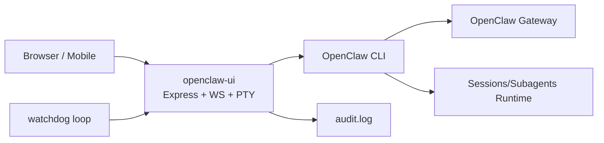

# Architecture

> 中文说明：该文档描述 `openclaw-ui` 与 OpenClaw/Gateway/会话运行时的关系、请求流与可靠性模型。

> English note: This document describes the architecture, request flow, security, and reliability model of `openclaw-ui` with OpenClaw runtime.

## High-level

## Runtime components

- **openclaw-ui**: HTTP API + WebSocket + static frontend
- **node-pty**: spawns shell commands and streams terminal output
- **OpenClaw CLI/Gateway**: source of system/session status and actions
- **watchdog scripts**: periodic health checks and automatic restart

## Request flow

1. User opens dashboard in browser/mobile.
2. Frontend calls `/api/board` and `/api/alerts` for status.
3. Quick command click sends WS event (`quick-run`).
4. Backend spawns PTY command, streams stdout via WS.
5. Audit events are appended to `audit.log`.

## Security model (current)

- Optional token auth (`UI_TOKEN`) via request header / WS query
- Basic command risk keyword blocking
- Local audit logging for command traceability

## Reliability model

- `openclaw_ui_watchdog.sh` performs liveness checks
- `openclaw_ui_watchdog_loop.sh` runs periodic checks (default: 60s)
- On unhealthy/missing process, dashboard is restarted automatically
